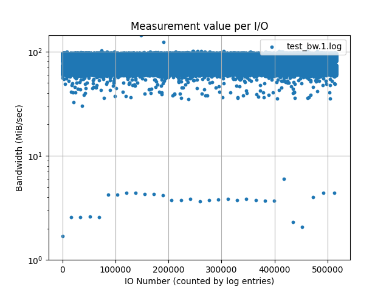
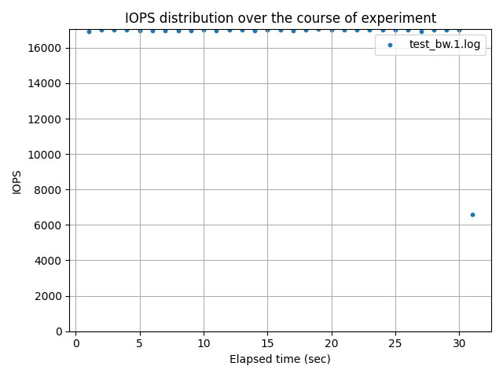
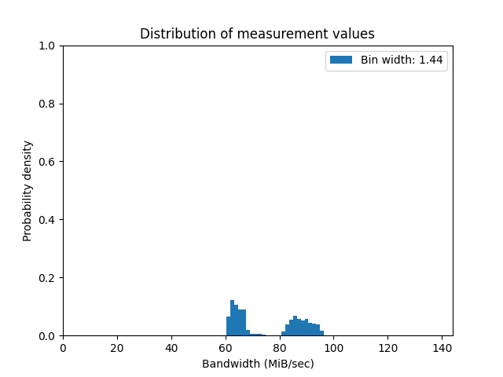

# FioLogParser
The purpose of FioLogParser and its associated scripts is to enable parsing and processing of log files generated by Fio during experiments. For general uses, you can use scripts found in `/examples` such as `graph-ios-builder.sh` or `graph-io_count-builder.sh` to quickly generate graphs based on log files. 

This repository and the associated set of tools were built by Andreas Blanke ([@andSubmarine](https://github.com/andSubmarine)) and Magnus Krøyer ([@MackAtITU](https://github.com/MackatITU)) as part of their Master Thesis at the IT-University of Copenhagen (ITU).

***Table of Contents***:
- [FioLogParser](#fiologparser)
  - [Setup](#setup)
  - [FioLogParser](#fiologparser-1)
    - [Quick Start](#quick-start)
    - [Getting Started](#getting-started)
    - [Understanding `ios`](#understanding-ios)
    - [Understanding `io_count`](#understanding-io_count)
    - [Understanding `elapsed`](#understanding-elapsed)
  - [Advanced Usage](#advanced-usage)
  - [Advanced Usage - Histograms](#advanced-usage---histograms)

## Setup
Run the following to setup the required packages to run FioLogParser and associated scripts. Please be aware that the command should be run with administrive rights (Run as Administrator on Windows or with `sudo` on Linux):

```
pip install -r requirements.txt
```

Want to test that your setup works? Run the script `simple-example.sh` in the `/examples` folder and see if it generates the `output.png` graph.

Note that you need to have Python 3 installed on your system in order to run FioLogParser - in case you are on git bash on windows you may have to create a alias for the python3 command to point to python in order to run the example scripts: `alias python3=python`. 

## FioLogParser
The purpose of FioLogParser is to provide a general-purpose interface to scripts such as `fioelapsed.py` which generate different kinds of graphs based on Fio log files. 

### Quick Start
If you want to get started quickly with parsing a log file and building a graph then you can try out one of the following scripts found in the `/examples` folder:

- `graph-ios-builder.sh`: Builds graphs in `ios` mode which shows how measurements evolve over the I/O requests being performed which are organized by time
- `graph-io_count-builder.sh`: Builds graphs in `io_count` mode which shows how the number of the I/O requests evolves over time
- `graph-hist-builder.sh`: Builds graphs with `fiohistogram` which shows how measurements are distributed in the log file - see Histogram section below for more details

When running any of the above scripts, the script will prompt you for a directory to look for fio log files. Then it will prompt for the "log type", i.e. what kind of values that the log files contain. Finally, the script will prompt for the jobname used for logfile. For reference, the naming convention of log files is as follows:  `<jobname>_<logtype>.<jobnumber>.log`. Hint: if you want to build graphs for all jobs then simply use `*` instead of the jobname. The script will then automatically generate graphs for any files that it finds.

### Getting Started
If you want to get started with making your own custom types of graphs with FioLogParser then you can try to use the folloing command in the `/src` folder:

```
python3 fiologparser --mode ios --log_type bw --files ../test/test_bw.1.log
```

The first required argument `-m` or `--mode` can either be `ios`, `io_count` or `elapsed` and determines the mode for parsing and building the graph. These arguments are explained in detail in the next few sections.

The second required argument `-lt` or `--log-type` can either be `bw`, `lat` or `iops` and **indicates the metric used by Fio in the log file**. If you're in doubt about the log type then remember that `fio` typically uses a naming convention such as `<jobname>_<logtype>.<jobnumber>.log` so you can inspect the name of the file that you want to parse and find the logtype.

The third required argument `-f` or `--files` should be used with a list of filepaths for the files that `fiologparser` should parse. 

The general flow of execution when running FioLogParser is as follows:
- load and parse measurements from each log file into a `NumPy` array
- plot the array(s) using the arguments given with the help of `matplotlib`

Note that FioLogParser generally will output into the console how long it took to perform each operation.

Feel free to experiment with the arguments to see what kind of graphs you can produce - or feel free to use the argument list from one of the graph builder scripts listed under [Quick Start](#quick-start). For more information about each argument, see [Advanced usage](#advanced-usage).

### Understanding `ios`
In the `ios` mode, measurement values are plotted per I/O request as they appear in the log file. That means that the y-axis represents measurement values while the x-axis represent the order of I/O's being submitted and completed. 

The following example was generated from the `graph-ios-builder.sh` script and the file `test_bw.1.log` found in the `/test` folder. As you can see on the graph, bandwidth measurements are plotted on the y-axis with every I/O request being on the axis. Here the number of I/O requests are comparibly small - normally you would see numbers such as `2*1E5`. The y-axis in this example is logarithmic meaning that each new level is ten times larger than the previous level. The benefit of a logarithmic y-axis over an linear one is that it often reveals patterns that might otherwise be hidden. 




### Understanding `io_count`
In `io_count` mode, measurement values are not as such important and instead the frequency of IOs is measured by the standard metric called IOPS or Input / Outputs Per Second. This is done by examining and using the log file's timestamps and counting the amount of I/Os that occured over a period of time which is typically one second. The IOPS value is then plotted on the y-axis of the graph while the x-axis is used to show IOPS values change over time. 

The following example was generated from the `graph-io_count-builder.sh` script and the file `test_bw.1.log` found in the `/test` folder. As you can see on the graph, there isn't much change to the IOPS value on the y-axis over time. This is usually a good thing since that likely means that whatever experiment you ran with Fio was stable - at least within the window that you were running. If the IOPS value suddenly drops - let's say at about 30 seconds into the experiment - then this will be reflected on this graph and likely also on the previous `ios` graph. If this is the case then your results might need to be discarded and retried since that sort of behavior will skew the reported overview from Fio.



### Understanding `elapsed`
In `elapsed` mode then a average over a number of log entries is computed (can also be configured such that the log time is used for determining the average window). 

## Advanced Usage
The following can also be produced by running `fiologparser.py` with the `-h` or `--help` flag. Please note that some options are primarily used for specific modes such as `--every_nth`.

```
$> python fiologparser.py -h
Welcome to FioLogParser!
usage: fiologparser.py [-h] -m {elapsed,ios,io_count} -lt {bw,lat,iops} -f FILES [FILES ...] [-o OUTPUT] [--title TITLE] [-v] [--every_nth EVERY_NTH] [--same_time] [-ylog]  
                       [-agg] [-gt {default,bar,line,dots,errorbar}]

optional arguments:
  -h, --help            show this help message and exit
  -m {elapsed,ios,io_count}, --mode {elapsed,ios,io_count}
                        the mode used for parsing and building graphs
  -lt {bw,lat,iops}, --logtype {bw,lat,iops}
                        the type for values in files
  -f FILES [FILES ...], --files FILES [FILES ...]
                        absolute/relative filepaths for files to parse
  -o OUTPUT, --output OUTPUT
                        filepath for the built graph. defaults to 'output.png'
  --title TITLE         the title of the built graph
  -v, --verbose         print more information while running script
  --every_nth EVERY_NTH
                        iterate over n values. used for mode 'elapsed' and 'io_count'. defaults to 1
  --same_time           specify that iterations should occur based on time
  -ylog, --logscale_y   use a logirithm scale instead of a linear scale for the y-axis
  -agg, --aggregate_files
                        aggregate results from multiple logs into a single data set
  -gt {default,bar,line,dots,errorbar}, --graphtype {default,bar,line,dots,errorbar}
                        the type of graph to be built. defaults to a mode-specific default
```

The amount of optional arguments for FioLogParser is substantial and can be quite confusing. In order to help explain some of these, consider the following line from the `graph-io_count-builder.sh` script:

```
python3 ../src/fiologparser.py -m io_count -lt "${METRIC}" --title "IOPS distribution over the course of experiment" --every_nth 1000 --same_time -o "$name-iocount.png" -f "$f"
```

Most of these arguments have already been explained by [Getting Started](#getting-started). However a few require more explanation - namely the every_nth and same_time arguments. By specifying these we ask FioLogParser that *it should not plot **every** value, but instead combine the values that exists **within the same second***. This is useful for multiple reasons - with these you can suddenly plot I/O requests per second (IOPS) and not just plot each IO. The major difference between `io_count` and `elapsed` for these arguments is that *`io_count` will summarize these traces* and *`elapsed` will average these traces*. Your use case determines what you want to plot.

## Advanced Usage - Histograms
A rather recent addition to FioLogParser is the introduction of `fiohistogram.py` which purpose is to show the *distribution of the measurements within the time series*. Why would you want to see the distribution? Say that you have verified with `io_count` and `ios` graphs that your measurements are fairly stable over time. Your next question is likely to be: *"My graph is almost entirely blue due to the amount of plotted values - how can I see how many values are plotted?"*. This is where distribution histograms are useful and why you should use `fiohistogram.py`. 

Like `fiologparser.py`, the new `fiohistogram.py` has a lot of different arguments and functions. To get started you should try to generate three graphs exemplified by the three first lines in `graph-hist-builder.sh`: 

```
python3 ../src/fiohistogram.py -lt "${METRIC}" -f "$f" -m simple -o "$name-hist.png" --bins 100
python3 ../src/fiohistogram.py -lt "${METRIC}" -f "$f" -m simple -o "$name-hist-ylog.png" --bins 100 --ylog
python3 ../src/fiohistogram.py -lt "${METRIC}" -f "$f" -m simple -o "$name-cdf.png" --bins 100 -hm cdf  
```

Let's go through them one by one. The first creates a simple histogram where each measurement value is put in one out of 100 bins. *Each bin will then span about 1/100th of the range between the minimum and maximum value of the dataset*. Consider the following graph as an example which is the result of running the command on `test_bw.1.log` found in the `/test` folder. The default histogram mode (i.e. `--hist_mode`) is set to generate the histogram as a probability density function (`pdf`) which means that the height of each column on the histogram shows large a percentage of values fit into the associative bin. This example graph shows a [*multimodal distribution*](https://en.wikipedia.org/wiki/Multimodal_distribution) - your graph might show something entirely different.



In case you see a single column that is almost 1.00 or 100% even though you've set bins to 100 then you might have a large number of outliers. For this reason you can try to use a logarithmic y-axis instead. Consider the following graph as an example  which is the result of running the second command (see previous code block) on `test_bw.1.log` found in the `/test` folder. Comparing the two example graphs shows that there exists some outliers both before and after the two peaks. In case you only had a single column without a logirithmic y-axis then you could use arguments to only look at a certain range of values. You might even find a multimodal distribution within that range!


The final command listed in the previous code block generates a different kind of histogram - namely as a cumulative density function (`cdf`). What's the difference between a `pdf` and a `cdf` you might ask? Well as you might guess from the name, the density is cumulative in a `cdf` - *that means that the height of a column shows how large a percentage of measurements are equal or lower than the value on the x-axis*. In the example graph below (which was also generated by the `test_bw.2.log` as previous examples) then you can see than almost 50% of measurements are below a bandwidth of about 65 MiB/sec.


Why does it matter if there is a multimodal distribution or something else? **Because if the distribution is not 'normal' then we can't rely on the mean to tell us anything useful**. The fourth line of the `graph-hist-builder.sh` script is an example of a different mode for `fiohistogram.py` - one which tries to plot a normal distribution over the dataset: 

```
python3 ../src/fiohistogram.py -lt "${METRIC}" -f "$f" -m normal -o "$name-hist-normal.png" --bins 100 -v
```


Clearly, as seen on the graph, the distribution is multimodal and not normal - thus a different estimation is needed to describe the data. This is where something like [Kernel density estimation](https://en.wikipedia.org/wiki/Kernel_density_estimation) becomes relevant. This is another mode supported by `fiohistogram.py` and an example can be seen in the final line of `graph-hist-builder.sh`. Note that calculation of these can be substantial due to a need to optimize for a proper kernel bandwidth first.

```
# warning enabling the next line will slow down execution considerably due to model training - use limit and/or cutoff to reduce dataset
# python3 ../src/fiohistogram.py -f "$f" -m kernel -o "$name-hist-kernel.png" --bins 100 -v -c 20 -ll 0.1 -kbw 0.5 
```

